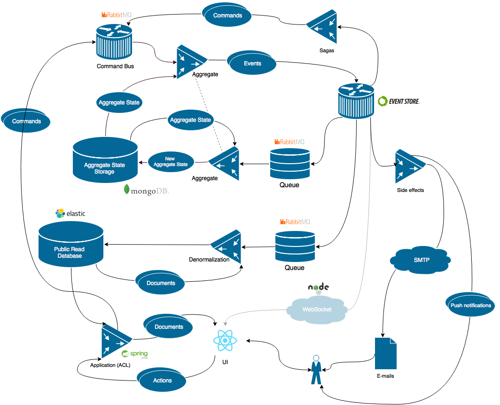

# Trippy [WiP]

Trippy is an over-engineered built with CQRS, Event Sourcing, NoSQL and all this funcy stuff.

This is my playground for some of ideas comes to my head every day which I can't use in real-world application or I don't want to.

It is not supposed to become real use application bu it *could*. 

## Architecture

